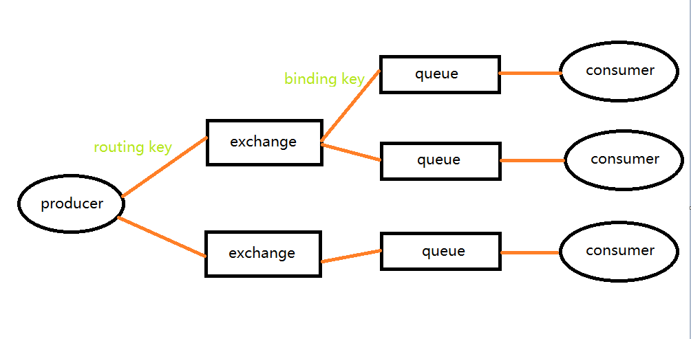
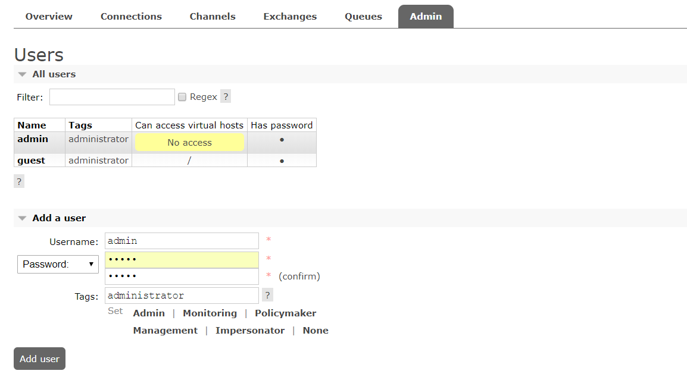
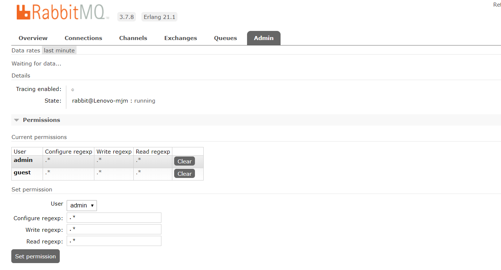
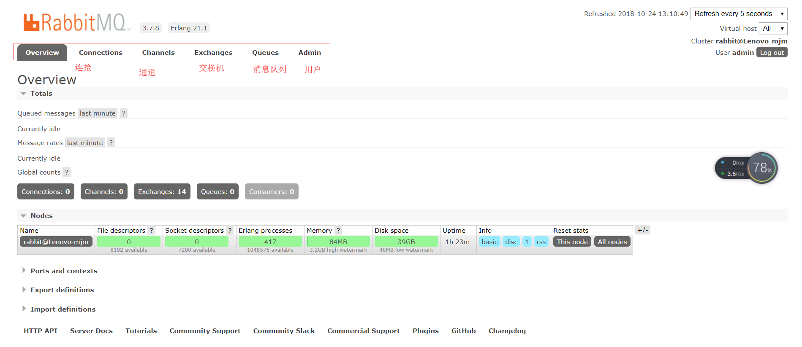

# rabbit MQ 安装 配置
1. 安装erlang  D:\Program Files\erl10.1
[erlang](http://www.erlang.org/downloads)
2. 安装 rabbitmq
[rabbit](http://www.rabbitmq.com/)

3. 打开RABBITMQ_HOME/sbin
    - 执行 rabbitmq-plugins enable rabbitmq_management 
    - 安装完毕后 就可以访问[rabbitmq 管理页面](http://localhost:15672)

4. 概念

   
  1.**Server(broker)**: 接受客户端连接，实现AMQP消息队列和路由功能的进程。

  2.**Virtual Host**:其实是一个虚拟概念，类似于权限控制组，一个Virtual Host里面可以有若干个Exchange和Queue，但是权限控制的最小粒度是Virtual Host

  3.**Exchange**:接受生产者发送的消息，并根据Binding规则将消息路由给服务器中的队列。ExchangeType决定了Exchange路由消息的行为，例如，在RabbitMQ中，ExchangeType有direct、Fanout和Topic三种，不同类型的Exchange路由的行为是不一样的。

  4.**Message Queue**：消息队列，用于存储还未被消费者消费的消息。

  5.**Message**: 由Header和Body组成，Header是由生产者添加的各种属性的集合，包括Message是否被持久化、由哪个Message Queue接受、优先级是多少等。而Body是真正需要传输的APP数据。

  6.**Binding**:Binding联系了Exchange与Message Queue。Exchange在与多个Message Queue发生Binding后会生成一张路由表，路由表中存储着Message Queue所需消息的限制条件即Binding Key。当Exchange收到Message时会解析其Header得到Routing Key，Exchange根据Routing Key与Exchange Type将Message路由到Message Queue。Binding Key由Consumer在Binding Exchange与Message Queue时指定，而Routing Key由Producer发送Message时指定，两者的匹配方式由Exchange Type决定。 

  7.**Connection**:连接，对于RabbitMQ而言，其实就是一个位于客户端和Broker之间的TCP连接。

  8.**Channel**:信道，仅仅创建了客户端到Broker之间的连接后，客户端还是不能发送消息的。需要为每一个Connection创建Channel，AMQP协议规定只有通过Channel才能执行AMQP的命令。一个Connection可以包含多个Channel。之所以需要Channel，是因为TCP连接的建立和释放都是十分昂贵的，如果一个客户端每一个线程都需要与Broker交互，如果每一个线程都建立一个TCP连接，暂且不考虑TCP连接是否浪费，就算操作系统也无法承受每秒建立如此多的TCP连接。RabbitMQ建议客户端线程之间不要共用Channel，至少要保证共用Channel的线程发送消息必须是串行的，但是建议尽量共用Connection。

  9.**Command**:AMQP的命令，客户端通过Command完成与AMQP服务器的交互来实现自身的逻辑。例如在RabbitMQ中，客户端可以通过publish命令发送消息，txSelect开启一个事务，txCommit提交一个事务。

[rabbitmq 六种消息类型](http://www.rabbitmq.com/getstarted.html)

添加一个用户

用户名 admin

密码 admin

tag: admin

我们看到刚添加完成的用户在vhost一栏是没有权限的,所以呢我们这个时候的给他设置一个vhost,那么这个vhost 就 相当于一个数据库(可以理解为mysql里面的一个db),我们 创建一个用户对其用户授权,他就可以访问了 

进入新增vhost 设置页面 给用户admin 添加权限 set Permisssion

退出guest 账号 登录 admin

OverView web控制台介绍

